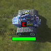

# idle Engineers 3

This is a reworked and improved version of one of my favourite mod for Supreme Commander: Forged Alliance Forever [(FAF)](https://github.com/FAForever/fa) - **Idle Enginers 2**

## Why remake? 
The latest version is from 2016, based on information from [FAF's](https://www.faforever.com) Mod Vault. It also suffers from some bugs, like not marks a captured engineers, does not follow switching army (eq. upon replays) etc. and is no longer maintained. At least what I know. And  due to some changes in score data in FAF, like counting units, it even shouldn't work anymore!

I've seen and tried other newer mods for the same thing, but neither was "good" for me - mostly because they're using icons. They're nice, but to me personally - it was too much visual clutter. So none of the curretly available mods actually served my taste - to have a **clear visibility** over economy units.

Another reason was to finally get closer to FAF modding, and learn something new. So this was written 100% from scratch.

## What improvements?
 My goal was to make a fast and (hope) bug-free plugin while keeping the visual simplicity. This version brings some new features and several improvements.
 
 **New features:**
 - provides a markers for Mexes, you can see, which one is in upgrade mode, so if you are not using pause-upgrade style, you'll find them easily
 - distinguishes experimental factories
 - distinguishes Sparky ;)

 **The improvements are:**
 - light on the UI game engine part as possible
 - pulls only relevant units from the game - less allocations
 - watches new units correctly - even if you capture an enginer or get a Full share
 - tries not to much occlude strategic icons - try on free camera
 - works correctly on splits and dual screens
 - follows the Hide UI panels correctly (many plugins simply ignores this and still draw their stuff)
 - shows overlays only for units that are in the viewport! Get more FPS
 - upon replay, correctly deletes the marks of the previous army when you change players
 - does not display marks when you are an Observer

## Bindable actions:
None, but bind the Toggle UI panels and you'll hide the tags.

## Compatibility
- does not depend on any other mod
- does not cause "re-selection sound"
- does not interferee with other mods
- does not interferee with upgradable buildings!
- properly conflicts-out other/older mods for "idle - something"
- **it is compatible with the vanila game!**