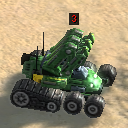

# idle Engineers 3
This is a reworked and improved version of one of favourite mod for Supreme Commander: Forged Alliance Forever [(FAF)](https://github.com/FAForever/fa) - **Idle Enginers 2**

## Why remake? 
The latest version is from 2016, based on information from [FAF's](https://www.faforever.com) Mods Vault. It also suffers from some bugs and is no longer maintained. At least what I know.

I've seen and tried other newer mods for the same thing, but neither was "good" for me - mostly because of the icons. They're nice, but to me - it was just another visual clutter, so none of the curretly available mods actually served well - to have **clear visibility**.

Another reason was to finally get closer to FAF modding, and learn something new.

## What improvements?
 My goal was to fix bugs and increase the performance while keeping the visual simplicity. This version brings several improvements.
 
 **The improvements are:**
 - select game units already filtered to engs, factories - smaller memory footprint
 - create an overlay only once for a new unit
 - watch new units correctly - even if you capture an enginer
 - follow the hidden user interface correctly - also hide everything (many plugins simply ignore this event and still draw their stuff)
- show overlays only for units that are in the viewport! Get more FPS
- upon replay, correctly delete the marks of the previous army when you change players
- does not display marks when you are an Observer

## Bindable actions:
None, but binding the Toggle UI panels will also hide the tags.

## Compatibility
- does not depend on any other mod
- does not cause "re-selection sound"
- does not interferee with other mods
- does not interferee with upgradable buildings!
- properly conflicts-out other/older mods for "idle - something"
- **it is compatible with the vanila game!**